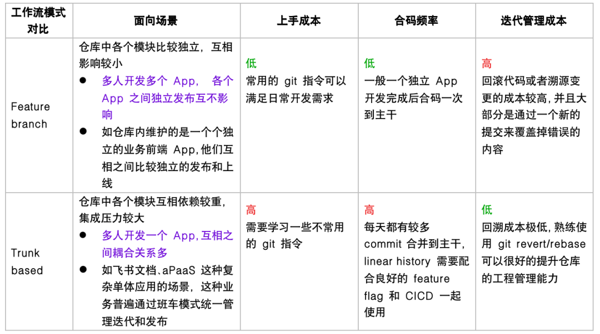

# Monorepo 下 Git 工作流的最佳实践

- [Monorepo 下 Git 工作流的最佳实践](https://mp.weixin.qq.com/s/tNs5CVdmj4DepYmELWjdzA)
- [A tidy, linear Git history](https://www.bitsnbites.eu/a-tidy-linear-git-history/)
- [Git history: work log vs recipe](https://www.bitsnbites.eu/git-history-work-log-vs-recipe/)
- [持续集成](https://www.martinfowler.com/articles/continuousIntegration.html)
- [Continuous Integration is Dead](https://www.yegor256.com/2014/10/08/continuous-integration-is-dead.html) 每个 Merge Request 分支在合并到 master 之前应该处于快进状态，因此，您需要通过 rebase 来确保该状态。（通过设置 master 分支为只读分支来实现）

1. Feature branch 和 Trunk-based 工作流是比较新晋的概念，二者是相对的、互斥的，它们组成一个全集；
2. Git flow, Gilab flow, Github flow 都属于 feature branch development，它们有一个共同点：都采用『功能驱动式开发』，即：需求是开发的起点，先有需求再有功能分支（feature branch）或者补丁分支（hotfix branch）；

