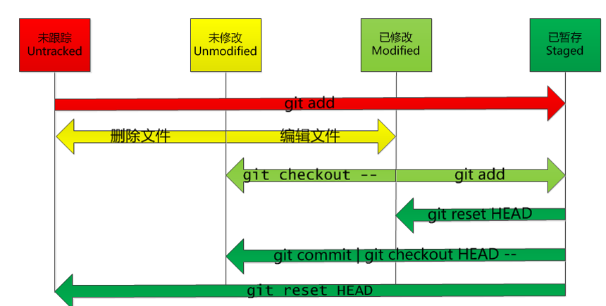

# git-command

摘自 [阮一峰：常用 Git 命令清单](https://www.ruanyifeng.com/blog/2015/12/git-cheat-sheet.html) 略改

一般来说，日常使用只要记住下图6个命令，就可以了。但是熟练使用，恐怕要记住60～100个命令。


图：阮一峰

几个专用名词的译名如下，**你必须要了解这几个概念**。

- Workspace：工作区/working directory
- Index / Stage：暂存区
- Repository：仓库区（或本地仓库）
- Remote：远程仓库

要熟练使用 Git，请记住下面这些命令

1. 创建新仓库/检出仓库

    ```bash
    # 在当前目录新建一个Git代码库
    $ git init

    # 新建一个目录，将其初始化为Git代码库
    $ git init [project-name]

    # 下载/检出一个项目和它的整个代码历史
    $ git clone <url>

    # depth用于指定克隆深度，为1即表示只克隆最近一次commit
    # 这时会产生一个问题，只会把默认分支clone下来
    $ git clone <url> --depth=1
    $ git clone/fetch <[git clone username@host:]/path/to/repository>

    # 增加一个新的远程仓库，并命名
    $ git remote add origin <server>
    ```

2. 配置

    参见 [./git-config.md#配置](./git-config.md#配置)

3. 添加/删除文件

    ```bash
    # 图解
                 add                 commit
    working dir  <=>  Index(Stage)    <=>    HEAD
    TODO:     rm/checkout            reset

    # 添加指定文件到暂存区（临时保存你的改动）
    $ git add [file1] [file2] ...

    # 添加指定目录到暂存区，包括子目录
    $ git add [dir]

    # 添加当前目录的所有文件到暂存区
    $ git add .

    # 添加每个变化前，都会要求确认
    # 对于同一个文件的多处变化，可以实现分次提交
    $ git add -p

    # 删除工作区文件，并且将这次删除放入暂存区
    $ git rm [file1] [file2] ...

    # 缓存区中删除，停止追踪指定文件，但该文件会保留在工作区
    $ git rm --cached [file]
    $ git rm -r --cached .

    # 改名文件，并且将这个改名放入暂存区
    $ git mv [file-original] [file-renamed]
    ```

4. 代码提交

    `git commit` 提交改动到 HEAD，但还没推送到远程（HEAD 指向最后一次提交）

    ```bash
    # 提交暂存区到仓库区
    $ git commit -m [message]

    # 提交暂存区的指定文件到仓库区
    $ git commit [file1] [file2] ... -m [message]

    # 提交工作区自上次commit之后的变化，直接到仓库区
    $ git commit -a
    $ git commit -am [message]

    # 提交时显示所有diff信息
    $ git commit -v

    # 使用一次新的commit，替代上一次提交
    # 如果代码没有任何新变化，则用来改写上一次commit的提交信息
    $ git commit --amend -m [message]

    # 重做上一次commit，并包括指定文件的新变化
    $ git commit --amend [file1] [file2] ...
    ```

5. 远程同步

    ```bash
    # 推送改动
    git push origin <any-branch>
    # 下载远程仓库的所有变动，但是并不合并到当前分支
    $ git fetch [remote]

    # 显示所有远程仓库，加 `-v` 可以将地址一起输出
    $ git remote [-v]

    # 显示某个远程仓库的信息
    $ git remote show [remote]

    # 增加一个新的远程仓库，并命名
    $ git remote add [shortname] [url]

    # 删除远程分支
    $ git remote rm origin
    # 如何删除远程关联？

    # 取回远程仓库的变化，并与本地分支合并
    $ git pull [remote] [branch]
    $ git pull origin remote:local
    $ git push origin local:remote
    # `git pull` 就是 `git fetch` 和 `git merge` 组成的

    # 如果本地分支没和远程关联，每次拉取必须制定分支，也可以使用下面方法关联分支
    $ git branch --set-upstream-to=origin/<branch> master

    # 上传本地指定分支到远程仓库
    $ git push [remote] [branch]

    # 强行推送当前分支到远程仓库，即使有冲突
    $ git push [remote] --force

    # 推送所有分支到远程仓库
    $ git push [remote] --all
    ```

6. 分支

    ```bash
    # 列出所有本地分支
    $ git branch | cat

    # 列出所有远程分支
    $ git branch -r

    # 列出所有本地分支和远程分支
    $ git branch -a

    # 新建一个分支，但依然停留在当前分支
    $ git branch [new-branch]
    $ git branch -m <branch-name> <branch-new-name>

    # 新建一个分支，并切换到该分支
    $ git checkout -b [new-branch]
    $ git checkout -b develop master
    $ git checkout -b dev origin/dev

    # 新建一个分支，指向指定commit
    $ git branch [new-branch] [commit]

    # 根据一个特定的提交创建新分支
    $ git branch [new-branch] HEAD^1

    # 新建一个分支，与指定的远程分支建立追踪关系
    $ git branch --track [branch] [remote-branch]

    # 切换到指定分支，并更新工作区
    $ git checkout [branch-name]

    # 切换到上一个分支
    $ git checkout -

    # 建立追踪关系，在现有分支与指定的远程分支之间
    $ git branch --set-upstream [branch] [remote-branch]

    # 合并指定分支到当前分支（可能出现冲突conflicts，需要手工合并这些冲突）
    $ git merge [branch]
    # 合并上一个分支
    $ git merge -

    # 选择一个commit，合并进当前分支
    $ git cherry-pick [commit]

    # 删除分支
    $ git branch -d [branch-name]
    $ git branch -D hotfix log test

    # 删除远程分支
    # gitlab codereview 后，经常删除了远程分支，但本地还存在 remote-tracking
    $ git push origin --delete [remote-branch]
    $ git branch -dr [remote/branch] # 仅仅删除远程跟踪
    $ git remote rm origin # 删除远程分支
    # Deleted remote-tracking branch origin/xxx (was 141f40c).
    # 如何批量删除跟踪?
    ```

7. 标签

    ```bash
    # 列出所有tag
    $ git tag

    # 新建一个tag在当前commit
    $ git tag [tag]

    # 新建一个tag在指定commit
    $ git tag [tag] [commit]

    # 删除本地tag
    $ git tag -d [tag]

    # 删除远程tag
    $ git push origin :refs/tags/[tagName]

    # 查看tag信息
    $ git show [tag]

    # 提交指定tag
    $ git push [remote] [tag]

    # 提交所有tag
    $ git push [remote] --tags

    # 新建一个分支，指向某个tag
    $ git checkout -b [new-branch] [tag]

    # 切换到某个特定的 tag
    $ git checkout [tag]

    # 切换到某个特定的分支，但是分支名和标签名重叠了
    $ git checkout [tags/v1.x]

    # 扩展
    # 先列出按照时间倒叙的 tag 列表，然后取出第一行
    $ git tag -n --sort=-taggerdate | grep n1

    # 利用 git log 的 format 取出 hash
    $ git log --format="%h" ${lastTag} |grep n1

    # 回滚
    $ get reset --hard ${lastTagHash}
    ```

8. 撤销

    ```bash
    # 恢复暂存区的指定文件到工作区
    # 此命令会使用 HEAD 中的最新内容替换掉你的工作目录中的文件，
    # 已添加到暂存区的改动以及新文件都不会受到影响
    $ git checkout [file]

    # 恢复某个commit的指定文件到暂存区和工作区
    $ git checkout [commit] [file]

    # 恢复暂存区的所有文件到工作区
    $ git checkout .

    # 重置暂存区的指定文件，与上一次commit保持一致，但工作区不变
    $ git reset [file]

    # 重置暂存区与工作区，与上一次commit保持一致
    $ git reset --hard

    # 重置当前分支的指针为指定commit，同时重置暂存区，但工作区不变
    $ git reset [commit]

    # 假如你想丢弃你在本地的所有改动与提交，可以到服务器上获取最新的版本历史，并将你本地主分支指向它
    $ git fetch origin
    $ git reset --hard origin/master

    # 重置当前分支的HEAD为指定commit，同时重置暂存区和工作区，与指定commit一致
    $ git reset --hard [commit]

    # 重置当前HEAD为指定commit，但保持暂存区和工作区不变
    $ git reset --keep [commit]

    # 新建一个commit，用来撤销指定commit（针对已经 push到远程，无法本地使用 reset修复的情况）
    # revert 是使用一个反向 commit 来抵消之前 commit 作出的修改而不是将之前的 commit 删除
    $ git revert [bad-commit]
    # https://github.com/geeeeeeeeek/git-recipes/wiki/5.2-%E4%BB%A3%E7%A0%81%E5%9B%9E%E6%BB%9A%EF%BC%9AReset%E3%80%81Checkout%E3%80%81Revert-%E7%9A%84%E9%80%89%E6%8B%A9

    # 暂时将未提交的变化移除，稍后再移入
    $ git stash
    $ git stash list
    $ git stash pop
    $ git stash clear
    ```

9. 查看信息

    ```bash
    # 显示有变更的文件
    $ git status

    # 显示有变更的文件 也显示忽略的文件
    $ git status --ignored

    # 显示当前分支的版本历史
    $ git log

    # 显示commit历史，以及每次commit发生变更的文件
    $ git log --stat

    # 搜索提交历史，根据关键词
    $ git log -S [keyword]

    # 只看某一个人的提交记录
    $ git log --auth=bob

    # 显示某个commit之后的所有变动，每个commit占据一行
    $ git log [tag] HEAD --pretty=format:%s

    # 显示某个commit之后的所有变动，其"提交说明"必须符合搜索条件
    $ git log [tag] HEAD --grep feature

    # 一个压缩后的每一条提交记录只占一行的输出
    $ git log --pretty=online

    # 树形结构展示所有分支，包含作者和标签
    $ git log --graph --oneline --decorate --all

    # 显示过去5次提交
    $ git log -5 --pretty --oneline

    # 显示某个文件的版本历史，包括文件改名
    $ git log --follow [file]
    $ git whatchanged [file]

    # 显示指定文件相关的每一次diff
    $ git log -p [file]

    # 看看哪些文件改变了
    $ git log --name-status

    # 显示所有提交过的用户，按提交次数排序
    $ git shortlog -sn

    # 显示指定文件是什么人在什么时间修改过
    $ git blame [file]

    # 显示暂存区和工作区的差异
    $ git diff

    # 显示暂存区和上一个commit的(本地库)差异
    $ git diff --cached [file]

    # 显示工作区与当前分支最新commit之间的差异
    $ git diff HEAD

    # 显示任意两个 commit 之间的差异
    $ git diff [commit-id] [commit-id]

    # 显示今天你写了多少行代码
    $ git diff --shortstat "@{0 day ago}"

    # 显示某次提交的元数据和内容变化
    $ git show [commit]

    # 显示某次提交发生变化的文件
    $ git show --name-only [commit]

    # 显示某次提交时，某个文件的内容
    $ git show [commit]:[filename]

    # 显示当前分支的最近几次提交
    $ git reflog
    ```

10. 其他

    > Golden Rule of Rebasing
    > 永远不要在public 分支上使用git rebase！

    ```bash
    # Squash 多个commit，在发起 PR 之前，应该把多个 commit 合并成一个（前提是该分支只有你一个人开发，且没有跟 master 合并过）

    # 合并多次提交纪录(commit 次数太多，不利于 Code Review，不利于排查问题)
    $ git rebase -i HEAD~4
    $ git rebase -i <commit hash>

    # 分支 branch-2 合并到 branch-1
    git rebase [branch-1] [branch-2]

    # 合并一段 commits
    $ git rebase --onto [base-branch] [from-branch] [to-branch]
    # 用于修正在错误点拉出分支并 committed 代码的问题
    # git rebase --onto master wrong_branch mine-update
    # 解释 git rebase --onto A B C
    # 切片 (B C]左开右闭
    # 示例如
    #

    # `--abort` 参数终止 rebase
    $ git rebase --abort

    # 统计出文件中还有多少个 TODO 字符串
    $ git grep --count TODO

    # 生成一个可供发布的压缩包
    $ git archive

    # 实用小贴士
    # 内建的图形化 git
    $ gitk
    # 彩色的 git 输出
    $ git config color.ui true
    # 显示历史记录时，每个提交的信息只显示一行
    $ git config format.pretty oneline
    # 交互式添加文件到暂存区
    $ git add -i
    ```

11. Git 如何同步上游分支代码?

    当参与开源项目或者采用 Fork 模式来协同开发时，常常会在自己的 Fork 分支上提交各种修改。上游仓库，也就是源分支代码更新了，我们 Fork 的下游分支，怎么同步上游仓库的更新呢？

    ```bash
    # 第一步：查看所有远程库的远程地址
    git remote -v

    # 第二步：添加源分支 URL
    git remote add upstream [源项目URL]

    # 第三步：检查所有远程库的远程地址
    git remote -v

    # 第四步：从源分支获取最新的代码
    git fetch upstream

    # 第五步：切换到主分支
    git checkout master

    # 第六步：合并本地分支和源分支
    git merge upstream/master

    # 第七步：Push 到 Fork 分支
    git push
    ```

用的多了就熟练了，Git命令行确实很简单而且功能十分强悍！建议多用用命令行模式。

## 进阶

删除 Git 历史记录中误提交的代码

有时，发现误提交了用户名密码或某产品密钥等隐私配置信息，现在想要剔除历史记录中已提交的记录怎么办？

```bash
git filter-branch --force --index-filter 'git rm --cached --ignore-unmatch yarn.lock' --prune-empty --tag-name-filter cat -- --all
```

如果你要删除的目标不是文件，而是文件夹，那么请在 `git rm --cached` 命令后面添加 `-r` 命令，表示递归的删除（子）文件夹和文件夹下的文件，类似于 `rm -rf` 命令。

参考：https://www.cnblogs.com/shines77/p/3460274.html

### 关于撤销




- `git reset` 使用本地仓库中的版本**覆盖**暂存区(Index/Stage)中的
  - 如果 workspace 中该文件没有其他修改，则 Stage 中的修改将应用到 workspace 中
  - (TODO:)如果 workspace 中有修改，则该修改的版本被保留，丢弃 Stage 中的修改。
- `git checkout` 则是使用 Stage 的中的版本覆盖 workspace。

reset soft

- `--soft` 参数将上一次的修改放入 staging area
- `--mixed` 参数将上一次的修改放入 working directory(默认)
- `--hard` 参数直接将上一次的修改抛弃

### 关于 `HEAD^` 和 `HEAD~`

首先，Git 提交可以有多个父级，使用 `^` 你可以找到任何提交的父级，而不仅仅是HEAD。你也可以追溯到几代人，使用 `~`。

- HEAD^ 表示当前分支的提交的第一个父级，是 HEAD^1 的缩写
- HEAD~ 意味着主分支的祖父母，在歧义的情况下指第一个父母
- 这些说明符可以被任意连接，例如，topic~3^2。
- 而HEAD@{2}变量捕获HEAD运动的历史，用于git reflog或git stash list

为了有一个直观的表示，让我们引用[文档](http://schacon.github.io/git/git-rev-parse#_specifying_revisions)的一部分：

> 以下是Jon Loeliger的插图。
> 提交节点B和C都是提交节点A的父节点。父提交从左到右排序。

```code
G   H   I   J
 \ /     \ /
  D   E   F
   \  |  / \
    \ | /   |
     \|/    |
      B     C
       \   /
        \ /
         A

A =      = A^0
B = A^   = A^1     = A~1
C = A^2  = A^2
D = A^^  = A^1^1   = A~2
E = B^2  = A^^2
F = B^3  = A^^3
G = A^^^ = A^1^1^1 = A~3
H = D^2  = B^^2    = A^^^2  = A~2^2
I = F^   = B^3^    = A^^3^
J = F^2  = B^3^2   = A^^3^2
```

参考：

- [**推荐**][常用 Git 命令清单](http://www.ruanyifeng.com/blog/2015/12/git-cheat-sheet.html)
- Git 常用命令图表——[思维导图-Git.png](http://pic002.cnblogs.com/img/1-2-3/201007/2010072023345292.png)
- [Git远程操作详解](http://www.ruanyifeng.com/blog/2014/06/git_remote.html)
- [图解4种git合并分支方法](http://yanhaijing.com/git/2017/07/14/four-method-for-git-merge/)
- [Git内部原理](http://yanhaijing.com/git/2017/02/08/deep-git-3/)
- [git --fixup & --autosquash](https://fle.github.io/git-tip-keep-your-branch-clean-with-fixup-and-autosquash.html)
- [git - 简明指南](https://rogerdudler.github.io/git-guide/index.zh.html)
- [diff](https://www.ruanyifeng.com/blog/2012/08/how_to_read_diff.html)
  - https://mirrors.edge.kernel.org/pub/software/scm/git/docs/git-diff.html
- [Pull Request 的命令行管理](http://www.ruanyifeng.com/blog/2017/07/pull_request.html)
- [Git request-pull　和 Github pull request](https://codingnote.com/2018/01/04/git-request-pull/)
