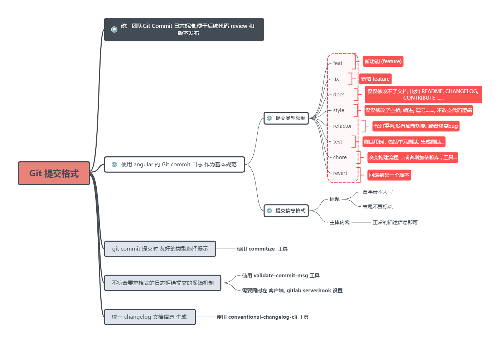

# git-commit-message

参考:

- [Commit message 和 Change log 编写指南](https://www.ruanyifeng.com/blog/2016/01/commit_message_change_log.html)
- [Git 原理入门](https://www.ruanyifeng.com/blog/2018/10/git-internals.html)
- https://github.com/feflow/git-commit-style-guide

- [Commitizen](https://github.com/commitizen/cz-cli)是一个撰写合格 Commit message 的工具。
- 【已废弃，改推荐用 commitlint】[validate-commit-msg](https://github.com/conventional-changelog-archived-repos/validate-commit-msg) 用于检查 Node 项目的 Commit message 是否符合格式。
- [commitlint](https://github.com/conventional-changelog/commitlint)
