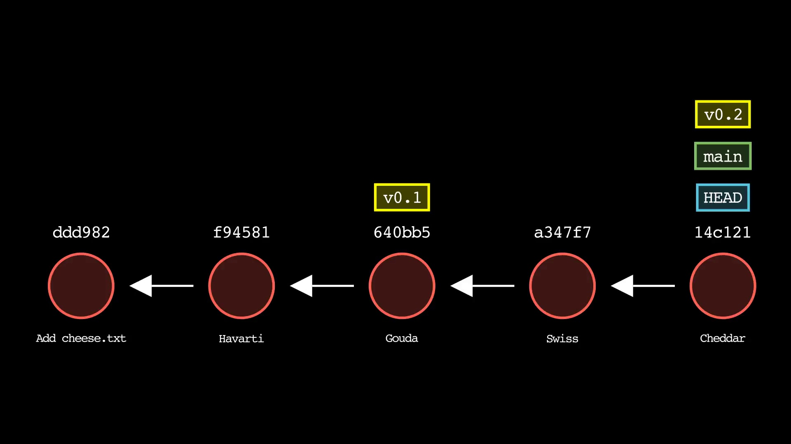
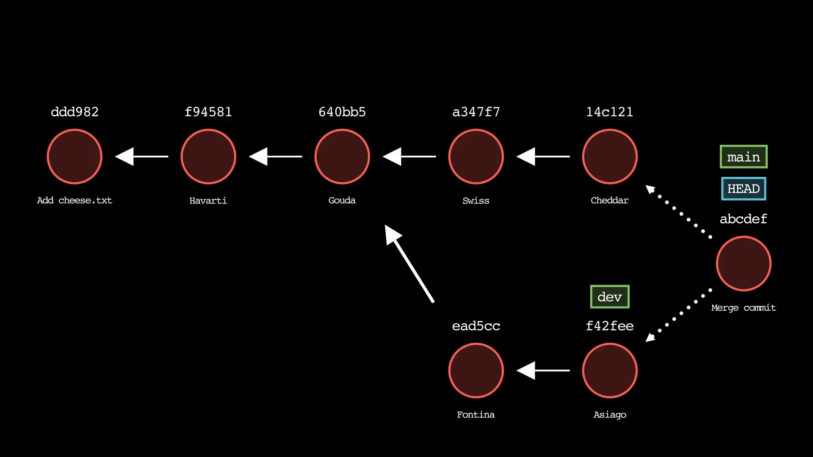

# git 可视化

- https://github.com/initialcommit-com/git-sim

```bash
# 安装
# mac 参考： https://docs.manim.community/en/stable/installation/macos.html
# 先安装依赖项
brew install py3cairo ffmpeg
pip3 install manim
brew install --cask mactex-no-gui
# 安装 git-sim
pip3 install git-sim

# 使用
git-sim log
git-sim status
git-sim merge <branch>
```

可选：如果您没有现有的 Git 存储库来模拟命令，请使用捆绑的git-dummy命令生成一个虚拟 Git 存储库，其中包含所需数量的分支和提交，以模拟 git-sim 上的操作：

```bash
git-dummy --name="dummy-repo" --branches=3 --commits=10
cd dummy-repo
git-sim [global options] <subcommand> [subcommand options]

# 或
git-dummy --no-subdir --branches=3 --commits=10 && git-sim [global options] <subcommand> [subcommand options]
git-dummy --no-subdir --branches=3 --commits=10 && git-sim log
```

效果图




